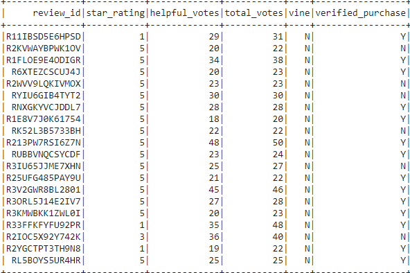

# Amazon Vine Analysis

## **Amazon Vine Analysis Overview:** 
The purpose of this project is to analyze Amazon reviews written by members of the paid Amazon Vine program. The Amazon Vine program is a service that allows manufacturers and publishers to receive reviews for their products. Companies like SellBy pay a small fee to Amazon and provide products to Amazon Vine members, who are then required to publish a review. In this part of the project, I've chosen to analyze the luggage dataset reviews and used PySpark to perform the ETL process to extract the dataset, transform the data, connect to an AWS RDS instance, and load the transformed data into pgAdmin. I used PySpark to determine if there is any bias toward favorable reviews from Vine members in the dataset.  The following summary of the analysis will be provided to Jennifer to submit to the SellBy stakeholders.

## **Amazon Vine Analysis Results:**
 ### Vine (Paid) Reviews
 
 
 
 - The number of reviews written by paid Vine program members was **21**.  
 - The number of five star reviews written by paid Vine program members **10**. 
 - The percentage of Vine paid reviews that were five stars was **47.62%**. 
 
 ### Non-Vine (Unpaid) Reviews 
 
 
 
 - The number of reviews written by unpaid or non-Vine members was **6,690**.  
 - The number of five star reviews written by unpaid or non-Vine members **3,448**. 
 - The percentage of unpaid or non-Vine member reviews that were five stars was **51.54%**.

## **Amazon Vine Analysis Summary:** 
In your summary, state if there is any positivity bias for reviews in the Vine program. Use the results of your analysis to support your statement. Then, provide one additional analysis that you could do with the dataset to support your statement.
The summary states whether or not there is bias, and the results support this statement (2 pt)
An additional analysis is recommended to support the statement (2 pt)

